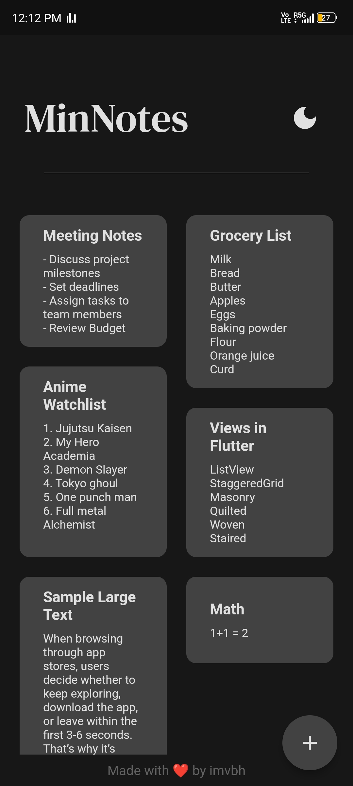

# MinNotes

MinNotes is a minimalist note-taking application built with Flutter. It offers a simple and intuitive interface for organizing your notes efficiently.

## Features

- Add, update, and delete notes
- Organize notes with grid layout
- Light and dark theme toggle
- Responsive and modern UI

## Screenshots




## Installation

### Prerequisites

- [Flutter SDK](https://flutter.dev/docs/get-started/install)
- [Dart SDK](https://dart.dev/get-dart)

### Steps

1. Clone the repository:
   ```bash
   git clone https://github.com/your-username/minnotes.git

2. Navigate to the project directory:

    ```bash
    cd minnotes

3. Install dependencies:

    ```bash
    flutter pub get

4. Run the app:

    ```bash
    flutter run

## Usage

    Add a Note: Tap the floating action button and enter the note details.
    Update a Note: Tap on a note to edit its details.
    Delete a Note: Long press on a note to delete it.
    Toggle Theme: Use the theme toggle button to switch between light and dark mode.

## Dependencies

    flutter
    provider
    isar
    path_provider
    google_fonts
    flutter_staggered_grid_view


## Contributing

    Contributions are welcome! Please fork the repository and create a pull request with your changes. Make sure to follow the code style and include tests for new features.
## License

    This project is licensed under the MIT License - see the LICENSE file for details.
## Credits

    Made with ❤️ by imvbh